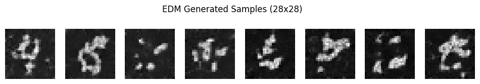

# Elucidated Diffusion Model (vibe-coded from  	arXiv:2206.00364)

Vibe-coded implementation of NVidia's 

["Elucidating the Design Space of Diffusion-Based Generative Models" ](https://arxiv.org/pdf/2206.00364) - arXiv:2206.00364

### Images generated from the baseline traditional DDPM

### Images generated by this comparable EDM

### Code

* Both models can be found self-contained in the jupyter notebook [here](./diffusion_model_demo.ipynb)

## Authors:

* 100% vibe-coded by ChatGPT and Claude.   No human-written lines of code here.
* See chat_history_summary.md for the prompts.

