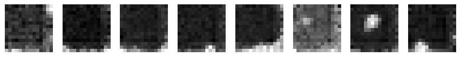

# 🧪 DIY Diffusion — A Vibe-Coded Fusion of Cutting-Edge Diffusion + Super-Resolution Techniques (Nvidia EDM, Google SR3, Toyota One Step SR)

> *A hands-on exploration of how far you can go by translating multiple ArXiv papers into working code combining them into a single, unified diffusion pipeline.*


All images in this readme were created by the code produced by the AIs in this project.

---

## 📌 TL/DR

A few AIs were asked to find and read SOTA research papers and build something cool.  I think they found interesting novel synergies between these papers.

---

## 📌 Overview

This project is a demonstration of what modern large language models can do when treated as autonomous research collaborators.  Starting from a prompt like:

* *“I’d like an interesting image-model project — diffusion models still feel like black boxes to me. Can you find papers that might help me understand them?”*

…the AI systems (ChatGPT, Grok, DeepSeek, Claude) did the rest:

- 🔍 Found (through web search), selected, and explained relevant diffusion papers  
- 📖 Educated the human about the concepts, architecture, and math in those papers  
- 🧮 Translated their core equations into working PyTorch code  
- 🧬 Combined techniques from multiple papers into a unified design  
- ⚡️ Iterated on architecture and hyperparameters through conversational debugging  
- 🧠 Tuned architectural details (like which layers use attention) to fit the constraints of the human’s low-budget hardware  
- 🖼 Produced **two complementary diffusion models**:  
  - 🎨 **A generative model** for synthesizing novel images from pure noise  
  - 🔍 **A super-resolution model** that progressively refines low-resolution images into high-quality outputs

The human role was minimal and mainly evaluative: supplying datasets and describing image outputs with prompts like:
* ***“some are nice cats, others are eldritch cat-dogs”***    


from which the AIs decided how to refine the model (in this case adding cross-attention to middle layers of the network to communicate information from more distant parts of an image).

As such, this repository is less about diffusion models alone and more about **how far autonomous AI collaboration has come** — showing that LLMs can now move from **“papers on arXiv” to “working implementation”** with humans acting only as curators and qualitative critics.

## How This Project Took Shape

This project began as an open-ended search for something visually ambitious enough to showcase what these AI collaborators could create, yet still just within the edge of what this human could follow. After exploring several possibilities together, three research papers emerged as particularly compelling foundations. 

- [**EDM (Nvidia)** — *Elucidating the Design Space of Diffusion-Based Generative Models*](https://arxiv.org/abs/2206.00364)  
- [**SR3 (Google)** — *Image Super-Resolution via Iterative Refinement*](https://arxiv.org/abs/2104.07636)
- [**Efficient One-Step Diffusion (Toyota)** — *Efficient Burst Super-Resolution with One-step Diffusion*](https://arxiv.org/abs/2507.13607)

They were chosen as complementary advancements in generative vision AIs -- each complex enough to demand original reasoning and synthesis from the AIs -- while remaining barely comprehensible to the human collaborator. By weaving ideas from these works into new implementations, the AIs didn’t simply “assist” in building a project — they envisioned and constructed one, with the human mostly running to keep up and marvel at how coherently it all fit together.

So, did the AIs create more than the sum of their parts?  I think so.  As far as I can tell, mixing the preconditioning and noise schedual of EDM with fast-start diffusion like Toyota's paper seems novel and better than other approaches!

### 🔬 NVIDIA EDM Deep Dive

The NVidia Paper *Elucidating the Design Space of Diffusion-Based Generative Models* studied the theoretical statistical math behind diffusion layers, and proposed a number of math-backed techniques to quantify what has traditionally been anecdotal arbitrary guesses in diffusion model software.  A great way to observe its benefits is to compare how fast EDM based models converge compared to traditional DDPM based diffusion models.

**Images generated from the baseline traditional DDPM diffusion model after training on MNIST for >1000 seconds.**    


**Images generated from this EDM diffusion model after training on MNIST for 240 seconds.**    


Note that it's totally acceptable that this model is hallucinating new digits.  The entire point to such diffusion models is to hallucinate new cats, dogs, dragons, wizards, whatever, from 100% random noise.  Both models can be found self-contained in the jupyter notebook [here](./diffusion_model_demo.ipynb) and a slightly more elaborate example [here](./mnist_EDM-vs-DPPM_with_attention_blocks.ipynb) showing the quality of results of a EDM and DPPM model at matching timesteps.

#### 1. Preconditioning & σ-dependent skip

EDM introduces a **preconditioning framework** that stabilizes training across a wide range of noise levels $\sigma$. Instead of predicting noise or signal directly, the network sees a **linear combination of input signal and a learned function**, scaled by σ-dependent factors:

$$
D_\theta(x; \sigma) = c_\text{skip}(\sigma) \, x + c_\text{out}(\sigma) \, F_\theta(c_\text{in}(\sigma) \, x; c_\text{noise}(\sigma))
$$

- $x = y + n$ is the noisy input (signal + noise)  
- $F_\theta$ is the neural network (UNet-style)  
- $c_\text{skip}(\sigma), c_\text{in}(\sigma), c_\text{out}(\sigma), c_\text{noise}(\sigma)$ are **σ-dependent scalars**  

This allows the network to estimate a continuum between the original signal $y$ and the noise $n$, rather than being forced into just one mode. The σ-dependent skip acts like a **dynamic shortcut**, letting the network “focus where it matters” depending on the noise level — near the input for high σ (noisy) and near the predicted output for low σ (denoised).

---

#### 2. Loss Function

The loss is carefully scaled to account for σ-dependent preconditioning:

$$
\mathcal{L}(\theta) = \mathbb{E}\Big[\lambda(\sigma) \, c_\text{out}(\sigma)^2 \, \big\| F_\theta(c_\text{in}(\sigma) \cdot (y+n); c_\text{noise}(\sigma)) - \frac{1}{c_\text{out}(\sigma)} \, (y - c_\text{skip}(\sigma) \cdot (y+n)) \big\|^2 \Big]
$$

- The inner term is effectively the **target for the network** after preconditioning  
- Multiplying by $c_\text{out}^2$ and $\lambda(\sigma)$ **rescales the MSE to give proper weighting across noise levels**, ensuring the network learns equally well at small and large σ  
- This formulation lets the network “understand” the varying difficulty of denoising at different noise strengths

---

#### 3. Stochastic Sampler

EDM’s **ancestral sampler** improves over standard DDPM samplers:

- It **injects stochasticity at each step** but in a carefully scaled way, reflecting the noise schedule  
- This allows high-quality image generation in **fewer steps** while maintaining diversity  
- The sampler effectively “head-starts” the generation at a higher σ than naïve DDPM, then gradually refines toward σ → 0

---

#### 4. Translating the Loss to Python

Here’s a compact Python translation of the paper’s preconditioning-aware loss:

```python
# x = y + n
# F = neural network Fθ
# c_in, c_out, c_skip, c_noise = functions of sigma
# lambda_sigma = weighting function

x_in = c_in(sigma) * x
pred = F(x_in, c_noise(sigma))
target = (y - c_skip(sigma) * x) / c_out(sigma)
loss = (lambda_sigma(sigma) * c_out(sigma)**2 * (pred - target)**2).mean()
```

#### 5. Why This Converges Faster Than DDPM

The combination of σ-dependent preconditioning and the carefully tuned stochastic sampler allows the network to focus its capacity where it matters most at each noise level. Unlike the naïve DDPM, which predicts noise with the same scale and architecture across all timesteps, EDM’s formulation dynamically rescales inputs, outputs, and the loss according to σ. This reduces training instability, ensures learning is effective at both high and low noise, and lets the sampler head-start the generation process — all of which translate into significantly faster convergence and higher-quality images in fewer steps.

### 🔬 Google SR3 Deep Dive

After building a generative diffusion model producing 64×64 images, we wanted to push beyond the limitations of our hardware without losing image quality. This is where **SR3 (Image Super-Resolution via Iterative Refinement, Google 2021)** came in. SR3 extends the diffusion framework to super-resolution by treating a low-resolution image as a noisy observation and applying a **progressive denoising process** to reconstruct the high-resolution counterpart.

Consider this diagram showing the intermediate states while training: 


* Given the low-res input image [leftmost]
* Create a high-res noised version of the image [second from the left]
* And train a model to predict the noise that needs to be removed [middle]
* Which identifies changes needed [second from right]
* To reconstruct the high-res image.


#### 1. Core Idea: Conditional Diffusion

SR3 frames super-resolution as a **conditional generation problem**: given a low-resolution image $x_\text{LR}$, the model predicts a high-resolution image $x_\text{HR}$ through iterative refinement. At each timestep $t$, Gaussian noise $n_t \sim \mathcal{N}(0, \sigma_t^2)$ is added to the high-resolution target, and the network learns to denoise it conditioned on $x_\text{LR}$:

$$
x_t = x_\text{HR} + n_t, \quad F_\theta(x_t, x_\text{LR}, t) \approx n_t
$$

The network predicts the noise $n_t$ at each step, similar to standard diffusion, but now **conditioned on the low-resolution image**, guiding the refinement toward the correct high-frequency details.

#### 2. Iterative Refinement

Unlike single-step super-resolution methods, SR3 performs **multiple denoising steps**, progressively reducing noise while integrating structural information from the low-resolution input. This iterative approach produces crisper edges, better textures, and fewer artifacts compared to naive upsampling or one-shot methods.

#### 3. Architecture & Conditioning

The SR3 network uses a **UNet-style architecture** with attention mechanisms at multiple scales, similar to our base generative model. The key modification is the **conditioning injection**: features from the low-resolution image are integrated at multiple layers, ensuring that global and local structure is preserved throughout the refinement process.

#### 4. Why This Worked for Us

For our workflow, SR3 allowed us to take 64×64 outputs from our base diffusion model and generate **256×256 super-resolved images**. By decoupling generation from upscaling, we overcame hardware limitations while still producing high-quality results. This also set the stage for the **Toyota one-step super-resolution method**, which builds on SR3’s architecture to achieve faster single-pass refinement.

#### From SR3 to Toyota One-Step Super-Resolution

While SR3 achieves impressive results through iterative refinement, it still requires multiple forward passes per image, which can be computationally expensive. The **Toyota one-step super-resolution method** builds on SR3 by collapsing the iterative process into a single-step model, maintaining most of the high-frequency detail while drastically reducing inference time. In our workflow, this allowed us to upscale images generated by the base diffusion model even faster, demonstrating that carefully designed diffusion techniques can balance **quality, speed, and hardware efficiency**.


### 🚗 Toyota One-Step Super-Resolution: A Comparative Analysis

The Toyota Technological Institute's one-step super-resolution method, as detailed in their 2024 paper, introduces a diffusion-based approach that initiates from a low-resolution (LR) image, adds a controlled amount of noise, and then performs a **single-step denoising process** to achieve a high-resolution (HR) output. This technique significantly reduces computational overhead compared to traditional multi-step diffusion models. ([arXiv link](https://arxiv.org/pdf/2403.19428?utm_source=chatgpt.com))

In our implementation, we adopted a similar strategy but introduced a nuanced variation. Instead of starting with a fully noisy image, we:

1. **Upscaled the LR Image** – We began by upscaling the LR image to a higher resolution, providing a closer initial approximation to the desired HR image.  
2. **Added Controlled Noise** – A carefully calibrated amount of noise was introduced to the upscaled image, aligning with the noise schedule used in the diffusion model.  
3. **Adjusted the Noise Schedule** – We meticulously determined the appropriate noise level (σ) and corresponding timestep to match the diffusion model's schedule, ensuring consistency and stability during the denoising process.

This approach allows for flexibility: we can initiate the diffusion process from a state closer to the HR image (with minimal noise) or from a more noisy state, depending on the desired balance between fidelity and realism.

While Toyota's method focuses on a **single-step diffusion process** starting from a noisy LR image, our implementation offers a hybrid approach that can start from **varying levels of noise**, providing a tunable fidelity-realism trade-off. This adaptation enhances the versatility and applicability of the SR model across different hardware capabilities and quality requirements.

---


## 🧠 Why This Is Interesting

This project is notable not just for what it does, but for **how it came into existence**.

It was created almost entirely by large language models (ChatGPT, Grok, DeepSeek, Claude) which:

- 📖 Found (through web search), read and explained advanced diffusion papers  
- 🧮 Translated their equations into working PyTorch code  
- 🧬 Combined techniques from multiple papers into one coherent system  
- ⚡️ Iteratively debugged and refined the design based on observed behavior  

The **human role** in this project was mainly:

- 📝 Asking for papers and clarifications  
- 👁️ Qualitatively judging outputs (“these look like eldritch cat-dogs”)  
- 🐾 Providing datasets to train on

In other words, this repository is a case study of how **LLMs can act as autonomous research collaborators** — able to go from *“here are some papers”* to *“here is a working model”* with only high-level feedback from a human observer.

It demonstrates that the gap from **“research paper” to “running implementation”** can now be crossed by AI itself, with humans playing a largely evaluative role.

---

## ✨ Highlights

- 🧠 **Paper-inspired architecture** — EDM noise schedule + SR3 iterative refinement + optional one-step fast mode  
- ⚡️ **Compact implementation** — focused codebase that clearly maps to the equations in the papers  
- 🖼 **Multi-scale attention** — tuned spatial resolutions (e.g. 16×16 and 32×32) for strong structure  
- 🧪 **Empirically guided** — improved through iterative experiments and analysis of model failure modes  
- 🔬 **Readable & hackable** — designed for learning, experimentation, and extension

---

## 🖼️ Sample Results

| Early Training | Mid Training | Later Training |
| --- | --- | --- |
|  |  |  |

**Additional examples:**
- **Super-resolution:** 28×28 → 256×256 MNIST digits  
- **Cat vs dog dataset:** from nightmare hybrids → clean distinct animals  
- **Baseline comparison:** naive DPPM vs EDM-style weighting

> *“At epoch 3, we got a cat with 3 heads. By epoch 12, it was just a cat — and a cute one.”*

---

## 🧩 How It Works

Conceptually, the model integrates these pieces:

- **Noise schedule (EDM)**  
  - σ-space parameterization with optimal weighting  
  - Core objective:  
    ```
    𝔼[λ(σ) ||F_θ(c_in(σ)·y; c_noise(σ)) - c_out(σ)·y||²]
    ```
- **Sampling (EDM ancestral)**  
  - Adjustable “headstart” noise level for faster convergence
- **Refinement stages (SR3)**  
  - Progressive super-resolution jumps (e.g. 32→128→256 px)
- **One-step mode (Toyota)**  
  - Optional fast path for quick previews

---

## ⚙️ Requirements

- Python 3.10+  
- PyTorch  
- CUDA GPU (≈6 GB VRAM recommended)  
- A dataset of training images

---

## 📖 Usage

Clone and install:

```bash
uv run python
jupyter lab
```

---

## 🙌 Acknowledgments

- [NVIDIA — *Elucidating the Design Space of Diffusion-Based Generative Models (EDM)*](https://arxiv.org/abs/2206.00364)  
- [Toyota — *Efficient Burst Super-Resolution with One-step Diffusion*](https://arxiv.org/abs/2507.13607)  
- [Google — *Image Super-Resolution via Iterative Refinement (SR3)*](https://arxiv.org/abs/2104.07636)  
- And the helpful insights of LLM collaborators — ChatGPT, Grok, DeepSeek, and Claude — which made vibe-coding this system possible

---


## Authors:

* \> 95% vibe-coded by ChatGPT, Grok, Deepseek, and Claude.
  * Very few human-written lines of code here.
  * Even the bug-fixes are largely copy&paste from different chatbots.
  * Style changes are largely when different models were used for bug-fixes
* See chat_history_summary.md for the prompts that started the project, leading to the first working model.

## ⚖️ License

This project was created almost entirely by large language models, based on research papers.  
The human contribution was minimal and mostly evaluative: initiating the idea, requesting papers, and describing qualitative behavior of the generated images.

As a result, there may be **no copyright ownership** in the traditional legal sense — most jurisdictions require meaningful human authorship to grant copyright.

Accordingly:

- ⚠️ No copyright is claimed.
- ✅ To the fullest extent allowed by law, this work is **dedicated to the public domain**.
- 🌍 Where a legal dedication is required, this repository is released under [CC0 1.0 Universal (Public Domain Dedication)](https://creativecommons.org/publicdomain/zero/1.0/).

You are free to **use, modify, copy, and redistribute** this project for any purpose, without restriction.
